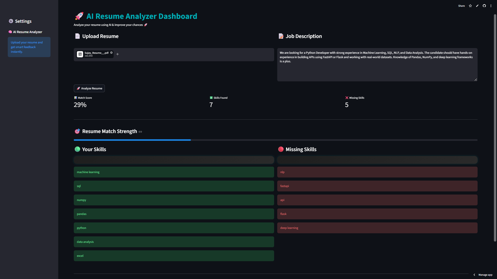

# 🚀 AI Resume Analyzer

An AI-powered web application that analyzes resumes and matches them with job descriptions using NLP and Machine Learning.

---

## 🌍 Live Demo

* 🔗 Web App: https://ai-resume-analyzer-guq89pthuypbfz3wfzkfye.streamlit.app/

---

## 📸 Demo Screenshot

> Upload a resume → paste job description → get match score + missing skills instantly

---

## 🔥 Features

* Resume parsing (PDF)
* Skill extraction using NLP (spaCy)
* Resume-job matching using TF-IDF & cosine similarity
* Smart scoring system (similarity + skill match)
* Missing skills detection
* PDF report generation
* Interactive UI (Streamlit Dashboard)

---

## 🧠 Tech Stack

* Backend: FastAPI
* Frontend: Streamlit
* NLP: spaCy
* ML: Scikit-learn
* PDF Tools: PyPDF2, ReportLab

---

## ⚙️ How to Run Locally

### 1. Clone Repository

git clone https://github.com/SUJAYBARAI/AI-Resume-Analyzer.git
cd AI-Resume-Analyzer

### 2. Install Dependencies

pip install -r requirements.txt

### 3. Install spaCy Model

python -m spacy download en_core_web_sm

### 4. Run Backend

cd backend
uvicorn main:app --reload

### 5. Run Frontend

cd frontend
streamlit run app.py

---

## 💡 How It Works

1. Upload your resume (PDF)
2. Enter job description
3. AI extracts text + skills
4. Calculates similarity score
5. Displays matched & missing skills
6. Generates downloadable PDF report

---

## 📌 Future Improvements

* AI-based resume suggestions
* Data visualization dashboard
* User authentication
* Custom domain deployment

---

## 👨‍💻 Author

Sujay Barai
Email: [sujaybarai46516@gmail.com](mailto:sujaybarai46516@gmail.com)
LinkedIn: https://www.linkedin.com/in/sujay-barai/

---

## ⭐ Support

If you like this project, give it a star on GitHub!
